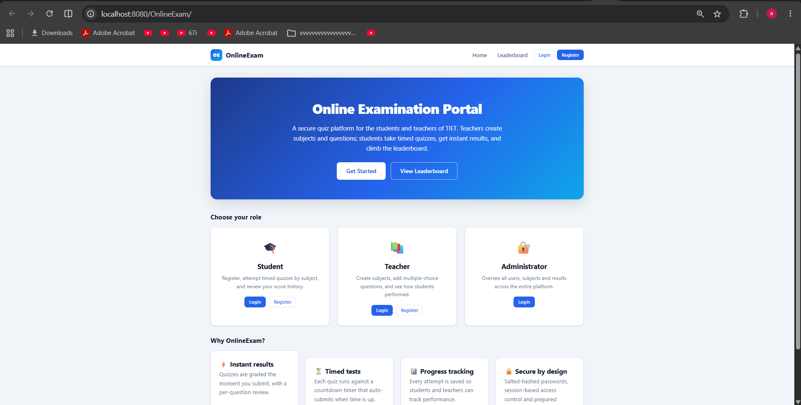
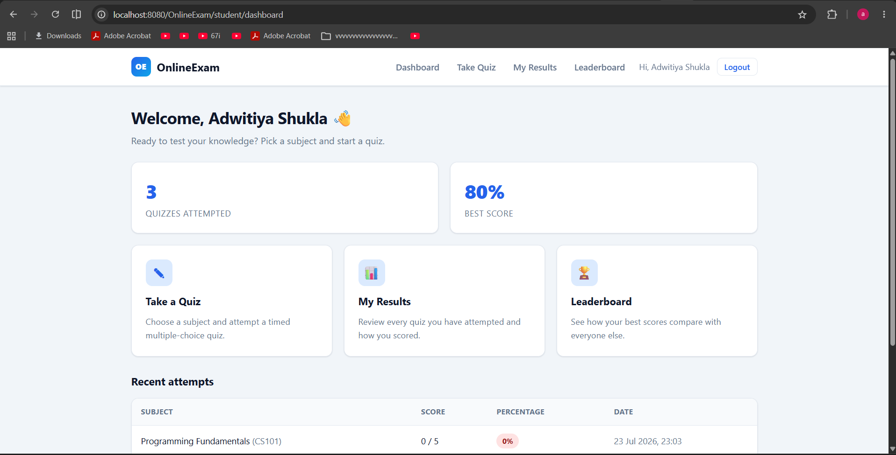
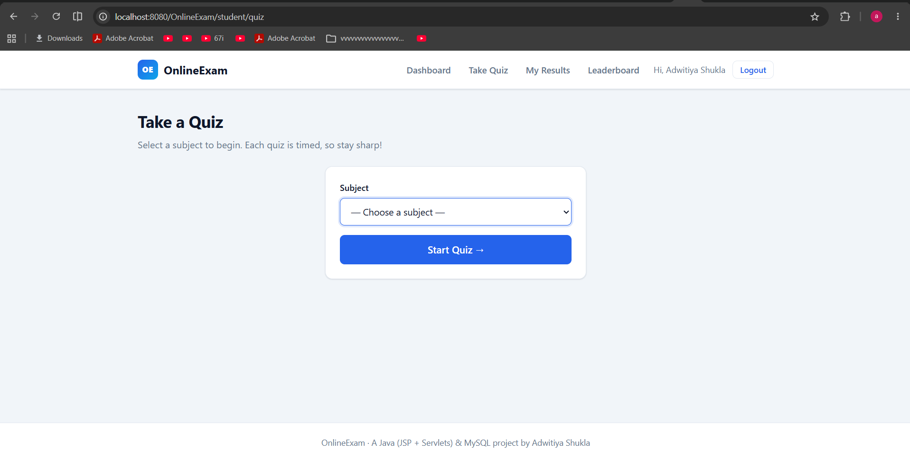
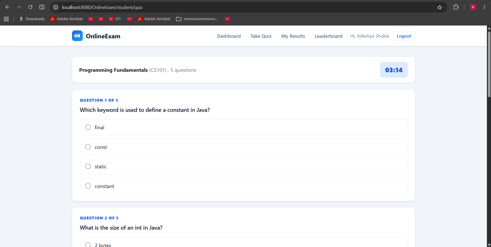

# OnlineExam

OnlineExam is a small web application where students can give online quizzes and teachers can add the questions for them.

The idea is pretty simple. A teacher logs in and adds subjects and multiple-choice questions. A student logs in, picks a subject and attempts a timed quiz. As soon as the quiz is submitted the student gets the score, and every attempt is saved so it can be shown later on the dashboard and on a common leaderboard.

It is written in plain Java using JSP and Servlets, the data is stored in a MySQL database, and it runs on an Apache Tomcat server.

## Screenshots

| Home page | Student dashboard |
|---|---|
|  |  |

| Choosing a subject | Quiz with the timer |
|---|---|
|  |  |

## What the app does

There are three kinds of users - student, teacher and admin - and each one gets its own section after logging in.

### Student

- Register and log in. Passwords are not stored as plain text, they are saved in a hashed form.
- Pick a subject from a dropdown and start a timed multiple-choice quiz.
- The quiz has a countdown timer (40 seconds per question) and it submits on its own once the time is over.
- After submitting, the student sees the score as a percentage and can check which answers were right and which were wrong.
- A "My Results" page lists all the quizzes the student has attempted so far.

### Teacher

- Log in to a separate teacher area.
- Create, rename and delete their own subjects.
- Add, edit and delete questions under a subject. The correct answer is chosen with a radio button so it always matches one of the four options.
- See all the attempts that students have made on their subjects.

### Admin

- A dashboard that shows how many students, teachers, subjects, questions and attempts there are in total.
- View and delete students, teachers and subjects.
- See every quiz attempt in the whole system.

There is also a leaderboard that anyone can open, which lists the top attempts ordered by percentage and then by score.

## Tools and technologies

- Java 17
- JSP and Servlets, running on Apache Tomcat 9
- JDBC with prepared statements to talk to the database
- MySQL 8
- HTML and CSS for the pages (one stylesheet, no CSS framework)

I kept it to core Java on purpose, without using a big framework like Spring, so that the basic working of Servlets, JSP and JDBC stays clear.

## How the project is organised

I followed the MVC (Model - View - Controller) pattern and split the Java code into packages based on what each part is responsible for:

- model - plain Java classes for the data (Student, Teacher, Admin, Subject, Question, Result)
- dao - the classes that actually run the SQL queries, one class per table
- controller - the Servlets that receive the requests and decide what to do
- filter - an AuthFilter that blocks the student, teacher and admin pages unless you are logged in as that kind of user
- util - small helper classes for password hashing and cleaning up form input

The JSP files are only used to show the pages. They don't contain any SQL or database code, all of that stays inside the DAO classes.

Folder layout:

```
OnlineExam/
  database.sql                 -> run this first to create the database
  README.md
  src/main/java/
    db.properties              -> database url, username and password
    com/onlineexam/
      model/
      dao/
      controller/
      filter/
      util/
  src/main/webapp/
    index.jsp                  -> the home page
    assets/css/style.css
    WEB-INF/
      web.xml
      lib/                     -> put the MySQL driver jar here
      views/                   -> all the JSP pages
```

## Database

The database is called college and it has these tables:

- student, teacher, admin - the user accounts (email and a hashed password)
- subject - a subject, linked to the teacher who created it
- question - a question with its four options and the correct answer, linked to a subject
- result - one row for each quiz attempt, linked to a student and a subject

The full script that creates everything (along with a bit of sample data) is in database.sql.

## How to run it

You will need JDK 17, Apache Tomcat 9, MySQL 8 and an IDE like Eclipse.

1. Create the database by running the SQL script:

   ```
   mysql -u root -p < database.sql
   ```

2. Open src/main/java/db.properties and change the username and password if yours are different.
3. Put the MySQL Connector/J jar inside src/main/webapp/WEB-INF/lib/.
4. Import the project into Eclipse, add it to a Tomcat 9 server and start it.
5. Open http://localhost:8080/OnlineExam/ in the browser.

## Demo accounts

The SQL script already creates these accounts so you can try the app right away:

| Type | Email | Password |
|---|---|---|
| Admin | admin@tiet.edu | Admin@123 |
| Teacher | prof.sharma@tiet.edu | Teacher@123 |
| Student | adwitiya@tiet.edu | Student@123 |

## Things I could add later

- Use a stronger hashing method like bcrypt and add a database connection pool.
- One time limit for the whole quiz and shuffling the order of the questions.
- Exporting results to a CSV file or showing some simple charts.

## License

This project is under the MIT License, see the LICENSE file.

## Author

Made by Adwitiya Shukla.
