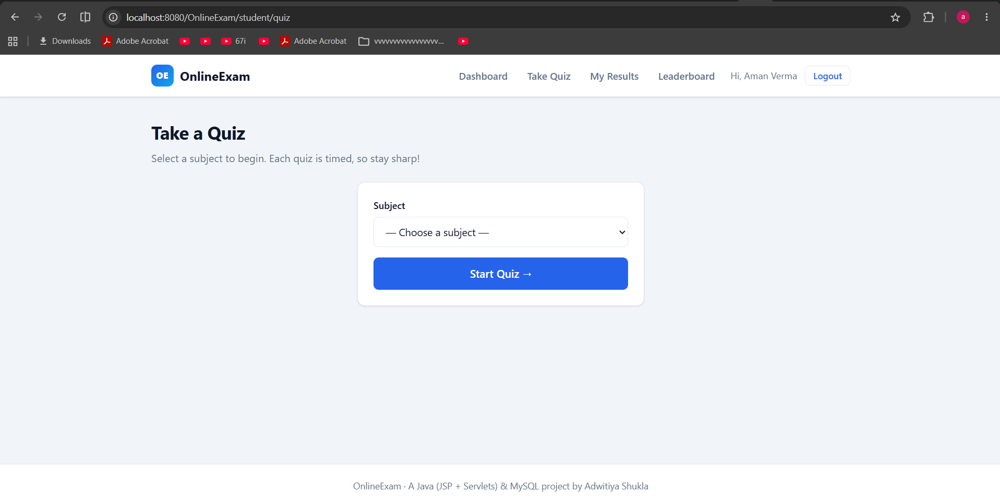
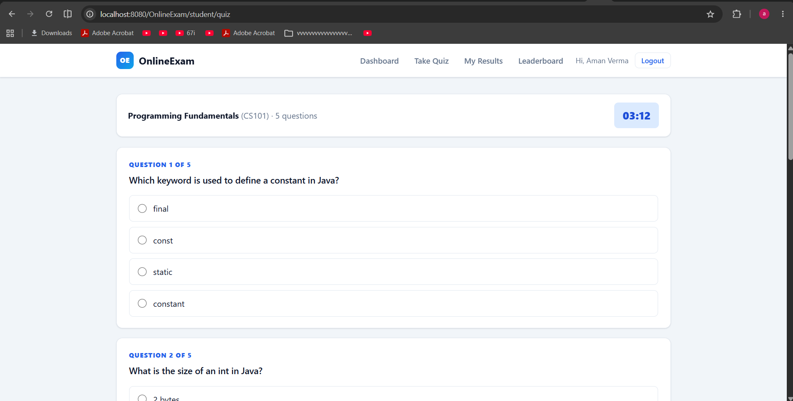

# 📝 OnlineExam — Online Examination Portal

A full-stack **online quiz / examination web application** for the students and
teachers of a college, built with **core Java (JSP + Servlets)**, the
**MVC architecture**, and a **MySQL** database running on **Apache Tomcat**.

Teachers create subjects and multiple-choice questions; students take **timed
quizzes**, get **instant, reviewable results**, and every score is saved so
students, teachers and admins can track performance on dashboards and a
**leaderboard**.


---

## 📸 Screenshots

| Landing page | Student dashboard |
|---|---|
|  |  |

| Choosing a subject | Timed quiz |
|---|---|
|  |  |

---

## ✨ Features

### 👨‍🎓 Student
- Register and log in securely (salted-hashed passwords).
- Pick a subject from a dropdown and take a **timed** multiple-choice quiz.
- Timer **auto-submits** when time runs out (40 seconds per question).
- **Instant result** with a percentage score ring and a **per-question review**
  (your answer vs. the correct answer).
- Full **attempt history** and a personal best-score stat.

### 👩‍🏫 Teacher
- Register / log in to a private teacher area.
- Create, rename and delete **subjects** you own.
- Add, edit and delete **questions** (the correct option is chosen by radio, so
  it always matches one of the four options).
- See **every student attempt** on your subjects.

### 🛡️ Administrator
- System-wide dashboard with live counts of students, teachers, subjects,
  questions and attempts.
- Manage (view / delete) all students, teachers and subjects.
- Inspect every quiz attempt in the system.

### 🏆 Everyone
- Public **leaderboard** ranking the top attempts by percentage then raw score.

---

## 🧱 Tech stack

| Layer            | Technology                                             |
|------------------|--------------------------------------------------------|
| Language         | Java 17                                                |
| Web / View       | JSP (thin views, HTML-escaped output) + a shared CSS design system |
| Controller       | Java Servlets (`javax.servlet`, `@WebServlet`)         |
| Data access      | JDBC + `PreparedStatement` (DAO pattern)               |
| Database         | MySQL 8                                                 |
| Server           | Apache Tomcat 9                                         |
| Access control   | Servlet `@WebFilter` + `HttpSession`                   |
| Security         | Salted, 100k-iteration SHA-256 password hashing (JDK only) |

> No external frameworks or build tools are required — this is deliberately a
> pure Java / JSP / Servlet / JDBC project.

---

## 🏗️ Architecture (MVC)

```
Browser ──HTTP──► Servlet (Controller) ──► DAO ──► MySQL
                        │                    ▲
                        ▼                    │
                   JSP (View)  ◄── Model (JavaBeans)
```

- **Model** — plain JavaBeans (`Student`, `Teacher`, `Admin`, `Subject`,
  `Question`, `Result`).
- **DAO** — one class per table; all SQL lives here behind `PreparedStatement`s.
- **Controller** — Servlets handle requests, talk to DAOs, and forward to JSPs.
- **View** — JSPs render data only (no SQL, no business logic).

### 📂 Project structure

```
OnlineExam/
├── database.sql                  # schema + demo seed data (run this first)
├── README.md
├── src/main/java/
│   ├── db.properties             # DB URL / user / password (edit me)
│   └── com/onlineexam/
│       ├── model/                # JavaBeans
│       ├── dao/                  # JDBC data-access objects + DBConnection
│       ├── controller/           # Servlets (16)
│       ├── filter/               # AuthFilter (session-based access control)
│       └── util/                 # PasswordUtil, WebUtil
└── src/main/webapp/
    ├── index.jsp                 # landing page
    ├── assets/css/style.css      # design system
    └── WEB-INF/
        ├── web.xml
        ├── lib/                  # ← put the MySQL Connector/J jar here
        └── views/                # all JSP views (student / teacher / admin)
```

---

## 🗃️ Database schema

| Table      | Key columns                                                        |
|------------|-------------------------------------------------------------------|
| `student`  | id, name, email (unique), password (hashed)                       |
| `teacher`  | id, name, email (unique), password (hashed)                       |
| `admin`    | id, email (unique), password (hashed)                             |
| `subject`  | code (PK), name, teacher_id → teacher                             |
| `question` | id, subject_code → subject, question_text, option1–4, correct_answer |
| `result`   | id, student_id → student, subject_code → subject, score, total, attempted_at |

Foreign keys use `ON DELETE CASCADE`, so removing a teacher or subject cleanly
removes its dependent rows.

---

## 🚀 Getting started

### Prerequisites
- JDK 17
- Apache Tomcat 9
- MySQL 8 (running locally)
- Eclipse IDE for Enterprise Java (or any IDE with a Tomcat runtime)

### 1. Create the database
```bash
mysql -u root -p < database.sql
```
This creates the `college` database, all tables, and demo data.

### 2. Configure the connection
Edit `src/main/java/db.properties` if your MySQL user / password differ:
```properties
db.url=jdbc:mysql://localhost:3306/college?useSSL=false&serverTimezone=UTC&allowPublicKeyRetrieval=true
db.user=root
db.password=YOUR_PASSWORD
```

### 3. Add the MySQL driver
Copy the MySQL Connector/J jar into `src/main/webapp/WEB-INF/lib/`:
```
src/main/webapp/WEB-INF/lib/mysql-connector-java-8.0.30.jar
```
(You already have this jar in your Tomcat `lib/` folder — just copy it in.)

### 4. Run
Import the project into Eclipse, add it to your Tomcat 9 server, and start it.
Then open:
```
http://localhost:8080/OnlineExam/
```

### 🔑 Demo accounts (created by `database.sql`)
| Role    | Email                  | Password      |
|---------|------------------------|---------------|
| Admin   | `admin@tiet.edu`       | `Admin@123`   |
| Teacher | `prof.sharma@tiet.edu` | `Teacher@123` |
| Student | `aman@tiet.edu`        | `Student@123` |

---

## 🧭 Application routes

| URL                        | Method | Description                          |
|----------------------------|--------|--------------------------------------|
| `/index.jsp`               | GET    | Landing page                         |
| `/login?role=…`            | GET/POST | Login (student / teacher / admin)  |
| `/register?role=…`         | GET/POST | Register (student / teacher)       |
| `/logout`                  | GET    | End session                          |
| `/leaderboard`             | GET    | Public leaderboard                   |
| `/student/dashboard`       | GET    | Student home                         |
| `/student/quiz`            | GET/POST | Pick subject → take quiz → submit  |
| `/student/results`         | GET    | Student attempt history              |
| `/teacher/dashboard`       | GET    | Teacher home                         |
| `/teacher/subjects`        | GET/POST | Manage subjects                    |
| `/teacher/questions`       | GET/POST | Manage a subject's questions       |
| `/teacher/results`         | GET    | Attempts on the teacher's subjects   |
| `/admin/dashboard`         | GET    | Admin stats                          |
| `/admin/students`          | GET/POST | Manage students                    |
| `/admin/teachers`          | GET/POST | Manage teachers                    |
| `/admin/subjects`          | GET/POST | Manage subjects                    |
| `/admin/results`           | GET    | All attempts                         |

---

## 🔒 Security highlights
- **Passwords are never stored in plaintext** — salted SHA-256 with 100,000
  iterations and a constant-time comparison on verify.
- **SQL injection safe** — every query uses `PreparedStatement`.
- **XSS safe** — all user-supplied output is HTML-escaped (`WebUtil.escape`).
- **Access control** — an `AuthFilter` guards `/student/*`, `/teacher/*` and
  `/admin/*` by session role, and teachers can only edit their own content.
- **No hard-coded credentials in code** — the database configuration lives in
  `db.properties`.

---

## 🌱 Possible future enhancements
- BCrypt/Argon2 hashing and a connection pool (HikariCP).
- Question randomisation and configurable per-quiz time limits.
- CSV export of results and richer analytics charts.
- REST API + a separate front end.

---

## 📄 License

Released under the [MIT License](LICENSE).

---

## 👤 Author
**Adwitiya Shukla** — originally a college mini-project, rebuilt into a
professional MVC web application.
